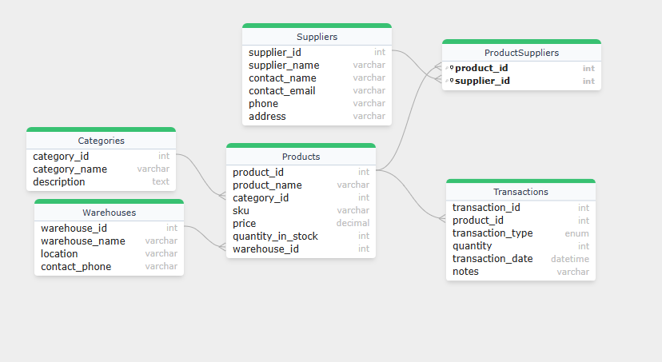

---

# Inventory Management System

## Description

This project is a relational database designed for managing inventory in warehouses. It tracks products, their categories, suppliers, warehouses, and stock transactions such as purchases, sales, and adjustments. The system ensures data integrity with proper keys and relationships to facilitate efficient inventory control and reporting.

## How to Set Up / Run

1. Install MySQL (if not installed already).
2. Open your MySQL client or MySQL Workbench.
3. Import the `inventory_management.sql` file:

   ```bash
   mysql -u your_username -p your_database_name < inventory_management.sql
   ```

   Or use the import feature in MySQL Workbench.
4. Once imported, you can start querying the database or build an application on top of it.

## ERD

The Entity-Relationship Diagram (ERD) for this project is located in the repository as `inventory_erd.png`.


---

